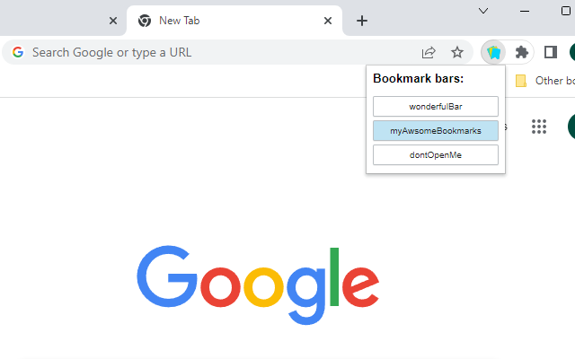

# Bookmark Bar Switcher

Bookmark Bar Switcher is a simple Chrome extension which allows users to conveniently switch between bookmarks using the
extension popup or keyboard shortcuts.

    

## Inspiration

The development of this extension was inspired by the
original [Bookmark-Bar-Switcher](https://github.com/zoeesilcock/Bookmark-Bar-Switcher). Sadly, it does not work with the
current version of Chrome any longer. Therefore, I have developed a new app using TypeScript as well as a number of MW3
exclusive features to recreate the basic functionality of the original.

## What the future holds

The extension is still in development and I will try to add additional features like renaming and reordering bookmarks
bit by bit. The extension will be released to the Chrome Web Store once all the important functionality has been
implemented.

For now, you can use the extension by enabling developer mode. Feel free to feed back and contribute!
Enjoy!
